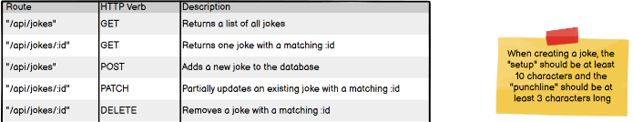
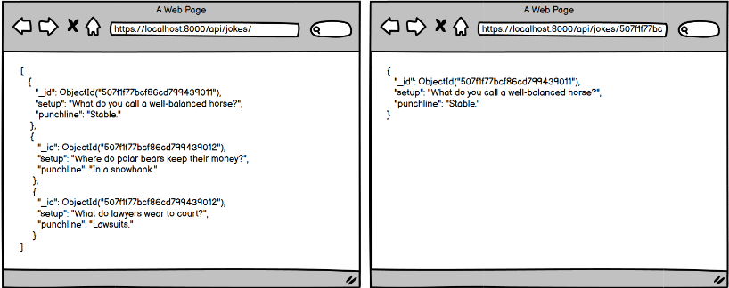
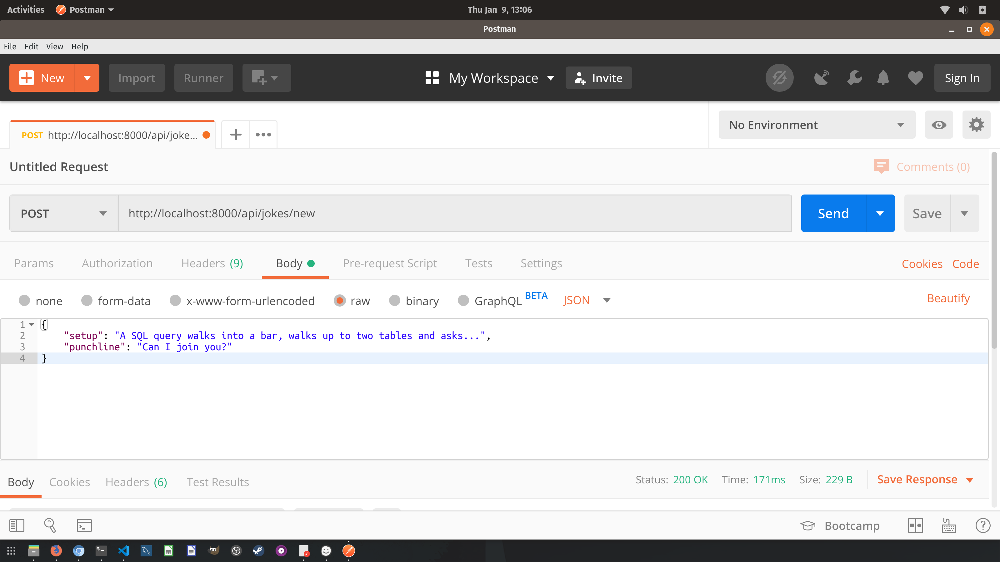
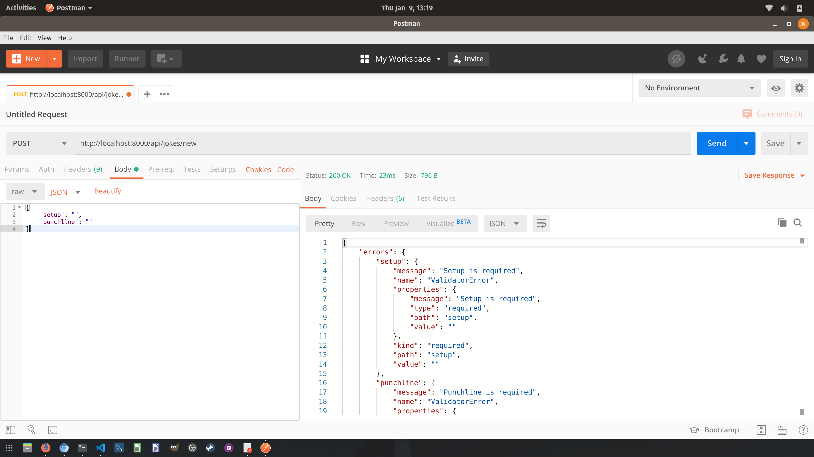
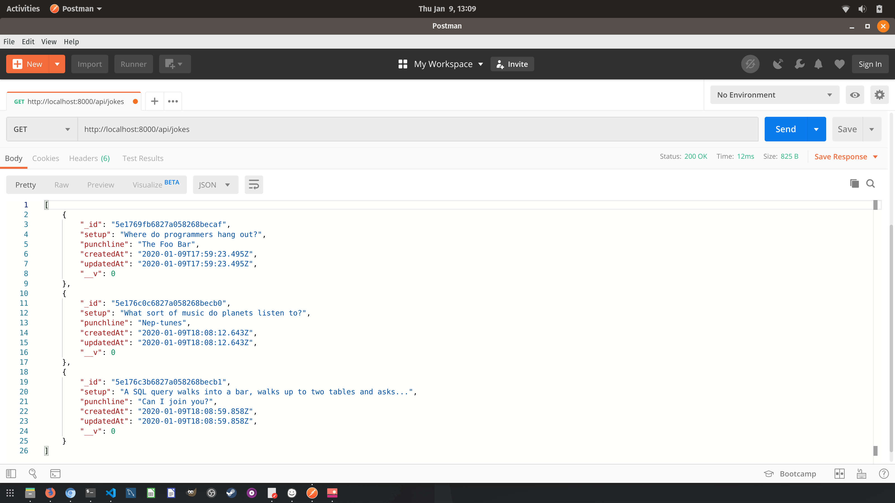

# Jokes API
To solidify what we've read about Mongoose commands and Express, let's create a new express project called "Jokes."

In this assignment, you'll create a hilarious node application that will feature the functionality to allow users to:

- Add a joke to the collection in our Mongo database using a POST HTTP Verb.
- Retrieve all jokes from the collection.
- Retrieve a single joke from the collection.
- Edit a joke from the collection.
- Delete a joke from the collection.

The routes should look similar to the following:

We can use a web browser or our Postman GET requests to view the contents of our collection. The image below provides an example of what we can expect to see if we enter the entire URI into the browser. Give it a shot, but note that using Postman to query the database is a better practice!

Here is an example of what we can expect to see from a POST request in Postman:

However, life does not always work as we intended, and we will encounter problems (erm, errors?) in our everyday lives. Set up validations in your model file and the proper response to a request that does not meet the validation criteria in your controller file. As shown below, we certainly don't want an empty request coming through. We want jokes!

After successfully adding a joke, use Postman to perform the POST DELETE and PUT/PATCH operations and confirm the routes work using your GET requests. The request that will return every joke in the collection is great for checking to ensure your POST, PUT/PATCH, and DELETE requests worked as intended!

## Ninja Bonus!

Once you've added all the standard CRUD routes and have them working properly, try to take a step further by adding a new route with logic to return a random joke!

Hint: If you need a refresher on generating random numbers, research the line `Math.random()`

- Create a project folder named jokes and setup a modularized folder structure
- Initialize the package.json and install express, dotenv and mongoose
- Connect to the database in the mongoose.config.js file.
- Add the necessary files in the model, controller and routes folders using proper naming conventions
- In the jokes.model file create a JokeSchema and export the mongoose.model("joke", JokeSchema)
- In the jokes.controller import your model from the models file
- Create and export functions to get, create, update and delete one joke and get all jokes.
- In the jokes.routes file: Set the exported functions from your controller file to a variable using the require keyword, then add an express route for every route listed in the wireframe
- In your server.js file: setup express, import your joke routes, and run your server
- Use Postman to create new jokes and confirm they've been added by using the GET request that returns all of the jokes in the collection
- Use Postman to perform the POST DELETE and PUT operations and confirm the routes work using your GET requests

