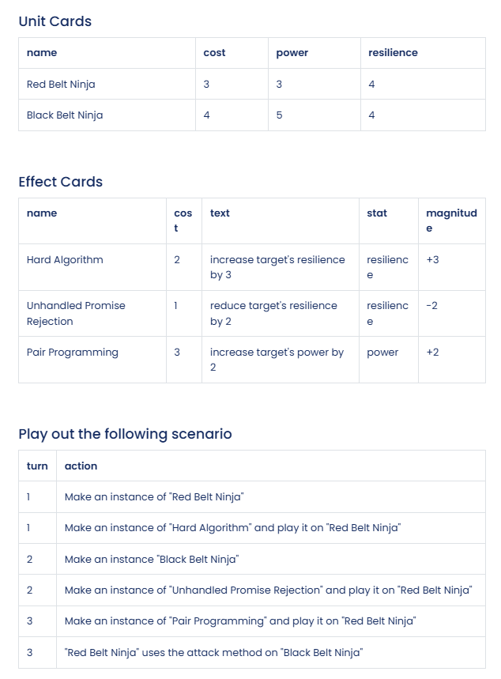

# It's Time to Duel

## Requirements:
- Make an instance of Unit called "Red Belt Ninja"
- Make an instance of Unit called "Black Belt Ninja"
- Make an instance of Effect called "Hard Algorithm"
- Make an instance of Effect called "Unhandled Promise Rejection"
- Make an instance of Effect called "Pair Programming"
- Play out the scenario described above