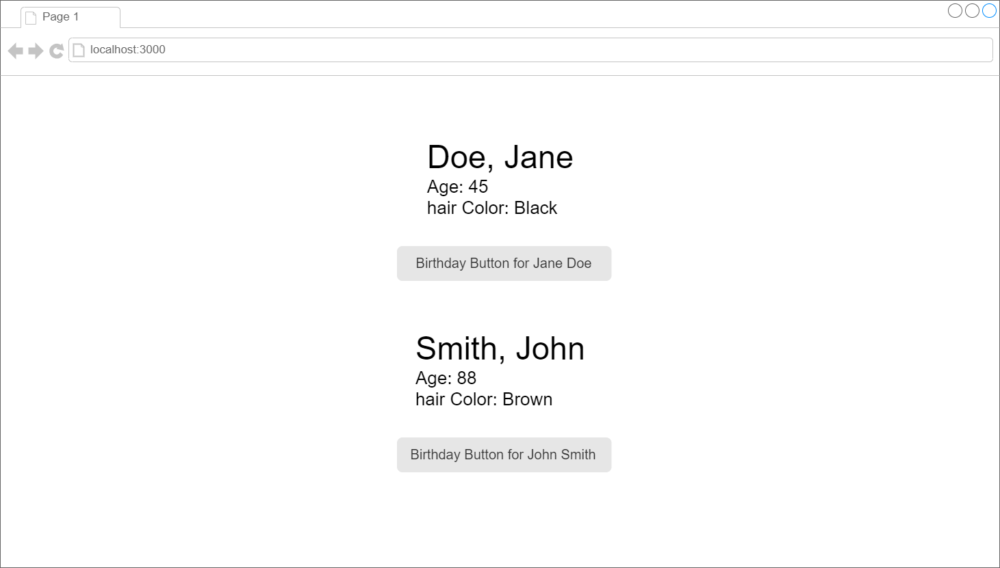

# Putting it Together
Using the same assignment as the Prop It Up assignment and state, create a birthday button that will increase one person's age by one.

## Requirements:

- Using the Prop It Up assignment, create a birthday button
- Have the button increase the person's age by 1 every time it is clicked
