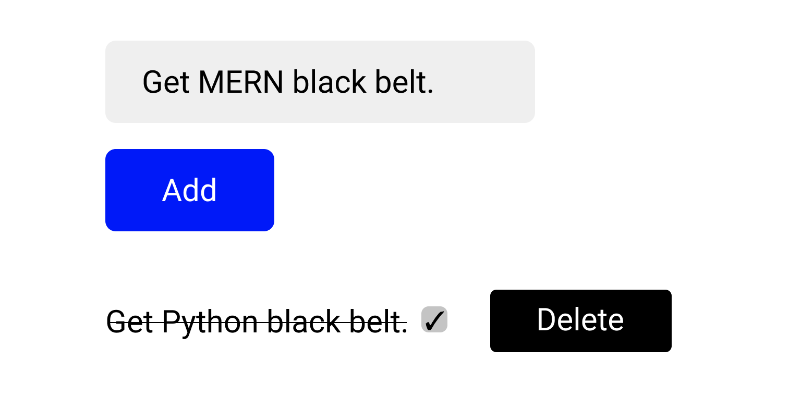

# Big Inversion
Redo the Todo List assignment using useReducer and ContextAPI to manage a global state.

## Requirements:

- Redo the Todo List assignment using useReducer and ContextAPI to manage a global state. 